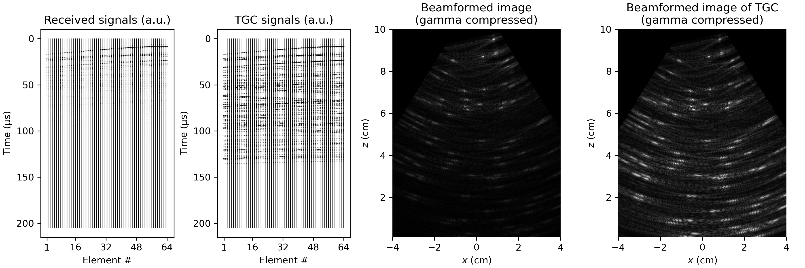

# ultrasound-python

A lightweight Python library for ultrasound imaging, designed for simplicity and educational purposes.


## Introduction

I wrote this library and the accompanying examples as a learning project on ultrasound imaging and signal processing. It is designed to be simple and easy to understand. It is not intended to serve as a full-featured ultrasound imaging library.

The library consists of a single file, `sonic.py`, which provides core functionalities for simulating ultrasound imaging, including frequency domain-based pressure field calculations, scatterer modeling, beamforming, I/Q demodulation, and time-gain compensation. However, this library is limited to 2D imaging with 1D linear arrays. It does not support curved arrays or other advanced features such as 3D imaging or Doppler imaging.

The library leverages NumPy and SciPy for core computations and supports parallel processing, thereby offering good performance adequate for educational use.

The examples below demostrate the primary functionalities of the library, while the supplementary examples provide insight into the impact of various parameters on ultrasound imaging. Additionally, the discussion section provides explanations for key design decisions made during the development of the library.

## Examples

### 1. Pressure field generated by a phased-array

By controlling the transmit delay of each element in the phased-array, the transducer can generate tilted, focused or divergent pressure fields.


### 2. Transmitted pressure signal from the transducer

The built-in transmitted signal is the same as the default one in the MATLAB UltraSound Toolbox (MUST), which is the convolution of a rectangularly-windowed sinusoid with the point spread function of the transducer.


### 3. Propagation of pressure wave in the medium

The time-domain pressure field is obtained through frequency-domain analysis.

<div style="text-align: left;">
    
    
</div>

### 4. Pressure field induced by scatterers

Scatterers are modeled as point sources that emit spherical waves. The intensity of the reflected wave from a scatterer is proportional to the pressure at its location and its reflectivity. The total pressure field is the superposition of the pressure fields generated by the transducer and the scatterers.


### 5. Propagation of pressure wave in the medium with scatterers

Pressure waves are reflected by scatterers, resulting in echoes that are received by the phased-array.


### 6. Beamforming

Using the Delay-and-Sum (DAS) algorithm, the positions of scatterers can be determined from the signals received by the phased-array.


### 7. I/Q demodulation and undersampling

In beamforming, I/Q demodulated signals are preferred over RF signals. RF signals contain high-frequency carrier waves that introduce ripples into the beamformed image. In contrast, I/Q signals contain only the low-frequency envelope of the transmitted signal, resulting in a much smoother beamformed image.

Undersampling is a technique used to reduce the computational cost of beamforming at the expense of image resolution. I/Q demodulation becomes crucial when undersampling is applied, because the appearance of the undersampled RF signal can differ significantly from its envelope.


### 8. Time-gain compensation

The amplitude of the received signal is attenuated as the distance between the transducer and the scatterer increases. Time-gain compensation (TGC) is used to amplify the received signal based on the depth of the scatterer, resulting in a more uniform brightness in the image.



### 9. Echocardiography

The simulation of echocardiography involves the following steps:

1. Generate the scatterers based on the grayscale reference image, where the reflectivity of each scatterer relates the grayscale value at its location.
2. Simulate the received signals by calculating the pressure field generated by the scatterers.
3. Apply I/Q demodulation and time-gain compensation to the received signals.
4. Beamform the augmented signals to generate the b-mode echo image.


## Supplementary examples

### S1. Pressure field generated by different probes

Probes with varying element counts, element widths, elevation focus, and center frequencies produce pressure fields with distinct focal depths, beam widths, and side lobe levels. Beams with higher center frequencies exhibit improved directivity but attenuate more rapidly with depth.


### S2. Pressure field generated by a phased-array with/without elevation focusing

Medical ultrasound probes with 1D arrays contain acoustic lens that focuses the ultrasound waves along the elevation direction, thereby increasing the pressure field in the imaging plane.


### S3. Effect of baffle impedance on the pressure field

The ratio between the medium and baffle impedances affects  the obliquity factor included in the directivity of the elements. However, the effect of the baffle impedance on the pressure field is not significant.


### S4. Effect of apodization on the pressure field

Apodization is a technique used to reduce the side lobes in the pressure field. This is achieved by assigning a weight to each element in the phased-array.


### S5. Pressure field generated by a subaperture of a phased-array

Using only a few elements of the phased-array results in a less focused beam with more noticeable side lobes compared to using the entire array.


### S6. Effect of apodization on the beamformed image

Apodization reduces side lobes in the pressure field but also decreases the amplitude of the main lobe, resulting in a less bright image. However, the overall impact of apodization on the beamformed image is not significant. However, using only a subaperture of the phased-array results in an image with a smaller field of view and noticeable artifacts.


### S7. Effect of aperture size on the beamformed image

The transmitted wave exhibits directionality, with most energy concentrated along the zero-degree direction. To improve image quality, not all signals received by the phased-array are used in beamforming. Signals from elements outside the aperture are excluded due to their low signal-to-noise ratio. In practice, the f-number should be carefully determined to ensure optimal image quality. However, in simulation results, the aperture size does not significantly affect the quality of the beamformed image.


### S8. I/Q demodulation and undersampling of RF signals

I/Q demodulation moves the center frequency of the RF signals to the baseband, resulting in low-frequency signals corresponding to the envelope of the RF signals. Beamforming using these low-frequency I/Q signals produces a smoother image than using high-frequency RF signals.

Directly beamforming with undersampled RF signals is impractical due to severe aliasing. However, I/Q demodulation can extract the low-frequency components from these undersampled RF signals, and the resulting I/Q signals can still be utilized for beamforming.


### S9. Structure of the DAS matrix

The DAS matrix is a sparse matrix used for fast beamforming.


### S10. Ultrasound imaging with different probes

Probes with higher center frequencies produce images with enhanced resolution but are limited in penetration depth due to the rapid attenuation of high-frequency waves.


## Discussion

### D1. Accuracy of pressure field calculation with respect to sub-element splitting

The pressure field is calculated using the far-field approximation, which assumes the element width is much smaller than the wavelength. To meet this requirement, each element is split into smaller sub-elements, and the pressure field is computed as the sum of their contributions. Without sub-element splitting, the pressure field calculation is inaccurate.


### D2. Approximation methods for integral calculation

According to Section 2.2 of the well-known paper of [SIMUS](https://doi.org/10.1016/j.cmpb.2022.106726), the integral in Eq. (11) can be approximated using the Gaussian superposition model to accelerate the calculation. However, in my tests, this method only provided a modest speed improvement of about 25% compared to calculating the accurate result using the Gaussian error function (erf). As a result, this approximation method is not employed in this library.

Test results (integral calculation for 100,000 points):

```plaintext
Calculating accurate results using erf: 0.335 s
Calculating approx. results using Gaussian superposition: 0.272 s
```

### D3. I/Q demodulation methods

In this library, I/Q demodulation is implemented by downmixing and low-pass filtering the RF signal. Alternatively, it can also be implemented through the Hilbert transform, which converts double-sideband signals to single-sideband signals, and the baseband can be obtained by downmixing. These two methods result in very similar beamformed images.


### D4. Using DAS matrix vs. direct interpolation

Constructing the DAS matrix is time-consuming. For a small number of signal frames, it is more efficient to use direct interpolation to calculate the delayed signals. However, for a large number of signal frames, precomputing the DAS matrix becomes more efficient.

Test results (beamforming with a 64-element phased-array and a 400x500 point mesh grid):

```plaintext
Beamforming using DAS matrix: 3.245 s (constructing DAS matrix: 3.174 s, matrix mul.: 0.071 s)
Beamforming using direct interpolation: 1.851 s
```

### D5. Using dB-thresholding during simulation

Simulating the pressure field generated by scatterers is computationally intensive. A dB-thresholding technique, which excludes frequency components with low amplitudes, can be employed to significantly reduce computation time with minimal impact on simulation results. For instance, applying a threshold of -40 dB can reduce computation time by 60% with negligible changes to the beamformed image. Futhermore, a threshold of -6 dB can achieve an 85% reduction in computation time with only slight variations in the beamformed image.


## References

This project references the open-source MATLAB UltraSound Toolbox (MUST), I extend my gratitude to the authors for their outstanding contributions to the field.

[1] Garcia, D. (2022). SIMUS: An open-source simulator for medical ultrasound imaging. Part I: Theory & examples. Computer Methods and Programs in Biomedicine, 218, 106726.

[2] Perrot, V., Polichetti, M., Varray, F., & Garcia, D. (2021). So you think you can DAS? A viewpoint on delay-and-sum beamforming. Ultrasonics, 111, 106309.

[3] https://www.biomecardio.com/MUST/

[4] https://verasonics.com/verasonics-transducers/
